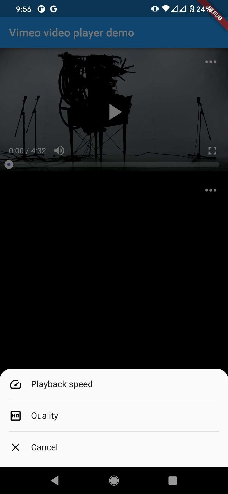
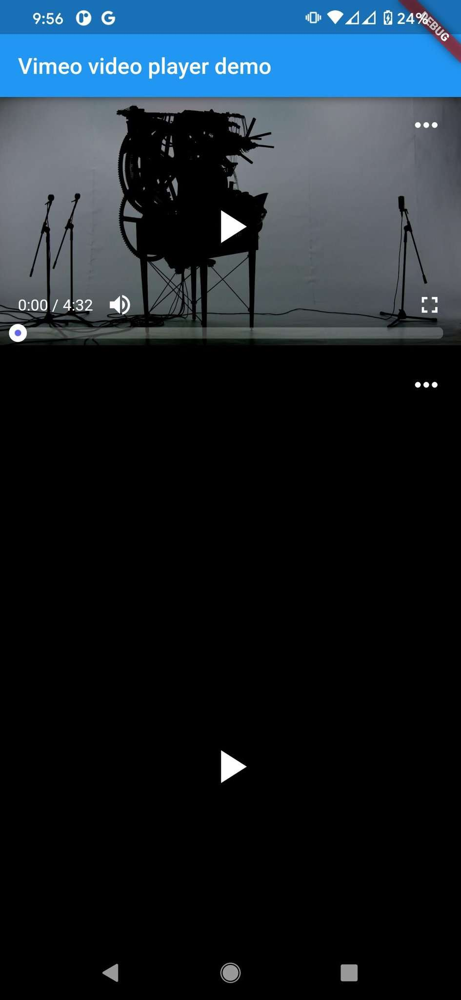
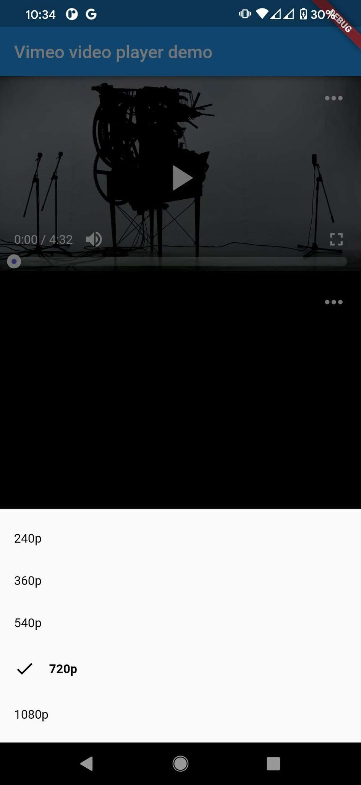

# [**Based on Vimeo VIdeo Player**](https://pub.dev/packages/vimeo_video_player)

# Features Custom

* Use library [flick_video_player_custom](https://pub.dev/packages/flick_video_player_custom)
* Change video quality (Default quality 720p or Highest quality)
* Change playback speed
* Overlay opens when touching video


# Demo Mobile




# Dependencies

* [dio](https://pub.dev/packages/dio): ^5.2.0
* [video_player](https://pub.dev/packages/video_player): ^2.6.1
* [flick_video_player_custom](https://pub.dev/packages/flick_video_player_custom): ^0.5.7

### Installation

Add the following dependencies in your pubspec.yaml file of your flutter project.

```dart
vimeo_video_player_custom: <latest_version>
```

# How to use

 Example

```dart
import 'package:flutter/material.dart';
import 'package:vimeo_video_player/vimeo_video_player_custom.dart';

class MyHomePage extends StatefulWidget {
  const MyHomePage({super.key, required this.title});

  final String title;

  @override
  State<MyHomePage> createState() => _MyHomePageState();
}

class _MyHomePageState extends State<MyHomePage> {
  @override
  Widget build(BuildContext context) {
    return Scaffold(
      appBar: AppBar(
        title: Text(widget.title),
      ),
      body: SingleChildScrollView(
        child: Column(
          mainAxisAlignment: MainAxisAlignment.center,
          children: <Widget>[
            VimeoVideoPlayer(
              url: 'https://vimeo.com/157743578',
              onFinished: () => onFinishedVimeo(),
            ),
            VimeoVideoPlayer(
              url: 'https://vimeo.com/740663286',
              onFinished: () => onFinishedVimeo(),
            ),
          ],
        ),
      ),
    );
  }

  void onFinishedVimeo() {
    print('onFinishedVimeo');
  }
}
```

